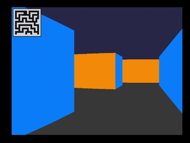

# Raycaster prototype

Prototipo de raycasting pseudo-3D (estilo Wolfenstein 3D / DOOM de SNES),
sin HUD, sprites, texturas ni enemigos. Solo el sistema de renderizado.

## Demostarción del funcionamiento



## Requisitos

- Rust + Cargo
- Dependencias de sistema de `raylib`
## Build y ejecucion

```bash
cargo run --release
```

`--release` importa bastante aqui: el raycaster hace un rayo por cada
columna de pantalla (800 columnas a 60 fps), y en modo debug Rust no
optimiza nada, así que puede sentirse con lag.

## Controles

- `W` / `S`: avanzar / retroceder
- `A` / `D`: rotar camara izquierda / derecha
- Cerrar ventana o `Esc`: salir

## Estructura

- `map.rs` — grid 16x16, `is_wall(x, y)`, punto de inicio del jugador.
- `player.rs` — posicion, angulo, velocidad, y `try_move` con colision (por eje, con deslizamiento a lo largo de paredes).
- `raycaster.rs` — `cast_ray` con DDA (digital differential analysis), devuelve distancia perpendicular ya corregida contra fish-eye.
- `renderer.rs` — techo y piso como rectangulos solidos, paredes como columnas verticales escaladas por `screen_height / distance`.
- `input.rs` — mapea W/S/A/D a movimiento/rotacion del jugador.
- `framebuffer.rs` — el mismo framebuffer de los labs de graficos (Image + `set_pixel`), con un `draw_rect` agregado para llenar regiones grandes rapido.
- `main.rs` — loop principal (input -> render -> swap_buffers) a 60 fps.

## Notas de diseno

- El FOV esta fijo en 60 grados (`PI / 3.0`), tipico de este tipo de raycasters.
- La correccion de fish-eye no es un paso aparte: `cast_ray` ya devuelve la
  distancia perpendicular al plano de la camara (no la distancia en linea
  recta jugador-pared), que es como se evita la distorsion sin ningun
  calculo extra en el renderer.
- Las paredes "verticales" (golpeadas en un paso de X) y "horizontales"
  (golpeadas en un paso de Y) usan dos tonos de rojo ligeramente distintos
  solo para que se note la geometria del laberinto; no es iluminacion real.
- El laberinto es fijo (no generado proceduralmente) pero navegable, con
  el punto de inicio del jugador en una celda abierta.

## Autor

Marcelo Detlefsen - 24554
