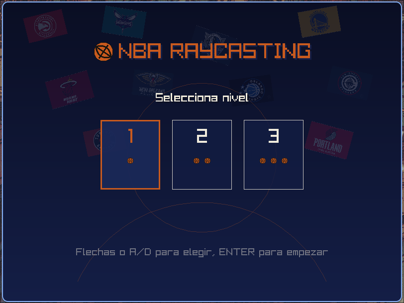
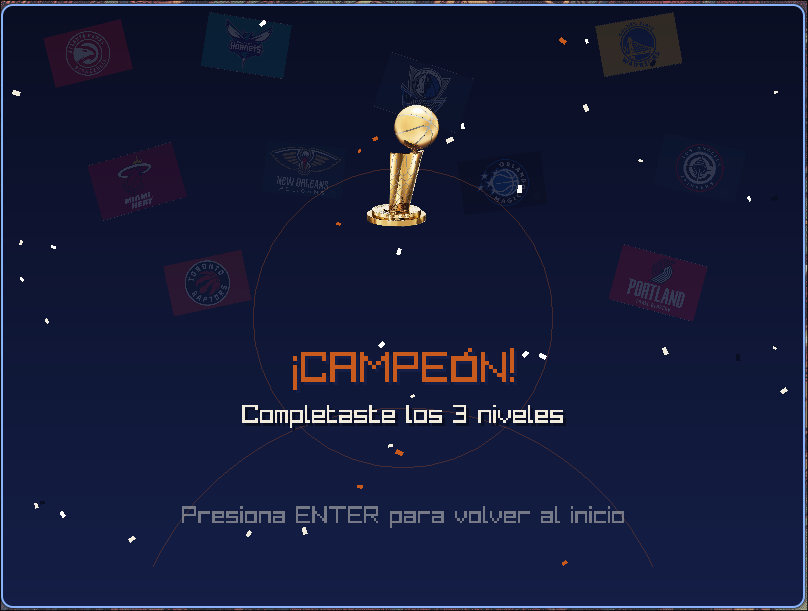

# NBA Raycasting 🏀

Ray caster pseudo-3D (estilo Wolfenstein 3D / DOOM de SNES) implementado en Rust
con `raylib`, con temática de la NBA: paredes texturizadas con los 30 logos de
equipos, piso de cancha con textura de duela real (floor casting), y una mecánica
de "encestar para avanzar" — recorres el mapa, encuentras los aros y encestas
dentro del rango de distancia correcto para pasar de nivel.

## Screenshots

### Gameplay


### Pantalla de bienvenida


### Pantalla de victoria


## Cómo correr el proyecto

### Requisitos

- Rust + Cargo
- Dependencias de sistema de `raylib`
- (Opcional) `ffmpeg` si necesitas convertir música/efectos a `.ogg`

### Build y ejecución

```bash
cargo run --release
```

`--release` importa bastante: se hace un rayo por cada columna de pantalla más
floor casting por cada fila de piso, a 60 fps. En modo debug Rust no optimiza
nada, así que se siente con lag notable.

## Controles

| Acción | Tecla / Input |
|--------|---------------|
| Avanzar / retroceder | Flechas o `W` / `S` |
| Rotar cámara (izquierda/derecha) | `A` / `D`, o mouse (eje horizontal) |
| Disparar (encestar) | `SPACE` o click izquierdo |
| Mostrar/ocultar minimapa | `M` |
| Navegar menús (selección de nivel) | Flechas o `A` / `D` |
| Confirmar / continuar | `ENTER` |
| Cerrar ventana | `Esc` o cerrar la ventana |

## Mecánica de juego

1. **Pantalla de bienvenida**: selecciona uno de 3 niveles (1, 2 o 3 aros
   respectivamente, con mapas de tamaño creciente).
2. **Gameplay**: recorre el mapa, encuentra los aros (sprites billboard con
   animación de red) y dispara cuando estés dentro del rango de distancia ideal
   y viendo hacia el aro.
3. **Feedback de tiro**: "¡MUY FUERTE!" si estás muy cerca, "¡MUY DÉBIL!" si
   estás muy lejos, "¡ENCESTASTE!" si acertaste — la bola falla, se reinicia
   automáticamente en tu mano, sin penalización.
4. **Pantalla de éxito** al completar todos los aros del nivel, avanza al
   siguiente; al completar el nivel 3, pantalla de victoria con confetti.

## Estructura

- `map.rs` — `MapGrid` en runtime (`Vec<u8>` aplanado), `is_wall`, `tile_at`,
  asignación de textura de pared por celda.
- `level_data.rs` — struct `Level` (grid, spawn del jugador, posiciones de aros,
  nombre) y los 3 niveles (`build_level_1/2/3`).
- `game_state.rs` — máquina de estados (`Welcome`, `Playing`, `LevelSuccess`,
  `Victory`), struct `Hoop` (estado + animación de encestada), lógica de disparo
  (`try_shoot`) con rango de distancia ideal + umbral de ángulo.
- `player.rs` — posición, ángulo, velocidad, `try_move` con colisión por eje
  (deslizamiento a lo largo de paredes).
- `raycaster.rs` — `cast_ray` con DDA, distancia perpendicular corregida contra
  fish-eye.
- `renderer.rs` — paredes texturizadas por columna, floor casting real con
  textura de duela, sprites billboard con z-buffer (ocluidos por paredes),
  minimapa, HUD tipo scoreboard.
- `textures.rs` — carga de texturas de pared, piso, aro (idle + 3 frames de
  animación), con fallback procedural si falta algún archivo en `assets/`.
- `audio.rs` — `MusicManager` (una pista por nivel, loop, streaming) y
  `SoundManager` (efecto de swish al encestar).
- `colors.rs` — paleta NBA (`NBA_ORANGE`, `NBA_NAVY`, `NBA_CREAM`) reutilizada en
  gameplay y pantallas de estado.
- `input.rs` — mapea teclado + mouse (rotación horizontal, sensibilidad
  ajustable) a movimiento/rotación del jugador.
- `framebuffer.rs` — framebuffer de los labs de gráficos (`Image` + `set_pixel`),
  con `draw_rect` para regiones grandes.
- `main.rs` — loop principal, match sobre `GameState`, transiciones (incluye
  captura/liberación de cursor y cambio de música según el estado).

### Assets esperados

```
assets/
├── walls/          # 30 texturas de logos NBA (png/jpg)
├── floor/wood.png  # textura de duela (fallback procedural si falta)
├── sprites/        # hoop_idle.png, hoop_score_0/1/2.png (fallback si falta)
├── ui/trophy.png   # trofeo de la pantalla de victoria (fallback con shapes si falta)
├── music/          # level1.ogg, level2.ogg, level3.ogg
└── sfx/            # swish.ogg
```

## Notas de diseño

- El FOV está fijo en 60 grados (`PI / 3.0`).
- La corrección de fish-eye se resuelve en `cast_ray`, que ya devuelve la
  distancia perpendicular al plano de cámara, no la distancia en línea recta.
- El floor casting usa el mismo esquema basado en ángulos (no vectores
  dir/plane) que el resto del raycaster, para que piso y paredes queden
  alineados en perspectiva.
- Los sprites de aro se proyectan con la misma fórmula lineal de cámara que las
  paredes (`camera_x = 2x/width - 1`), y se ocluyen contra un z-buffer llenado
  durante el paso de paredes.
- El acierto de tiro es "simulado" por distancia + ángulo (no física de
  proyectil real): hay un rango de distancia ideal por aro; muy cerca = tiro
  muy fuerte, muy lejos = tiro muy débil.
- Todas las texturas (paredes, piso, aro) tienen un fallback generado
  proceduralmente con `raylib::Image` si el archivo correspondiente no existe
  en `assets/`, para que el proyecto compile y corra sin los assets reales.
- La música usa streaming (`Music`, requiere `update_music_stream` cada frame)
  y cambia automáticamente según el nivel activo; el efecto de swish usa
  `Sound` (se carga completo, se solapa sin problema).

## Checklist de puntos (rúbrica del proyecto)

| Criterio | Puntos | Implementado |
|----------|--------|:------------:|
| Hardware distinto a computadora tradicional (criterio subjetivo, 0-80) | 0–80 | ❌ |
| Soporte de control/gamepad | 20 | ❌ |
| Estética del nivel (criterio subjetivo, 0-30) | 0–30 | ✅ |
| Rotación con mouse (horizontal) | 20 | ✅ |
| Disparo | 10 | ✅ |
| Minimapa en esquina, separado del mapa principal | 10 | ✅ |
| Música de fondo (no Taylor Swift) | 5 | ✅ |
| Efectos de sonido | 10 | ✅ |
| Animación de sprite (red del aro al encestar) | 20 | ✅ |
| Pantalla de bienvenida | 5 | ✅ |
| Selección entre múltiples niveles | 10 | ✅ |
| Pantalla de éxito | 10 | ✅ |
| **Total estimado (tope 100)** | **100 / 100** | |

## Autor

Marcelo Detlefsen - 24554